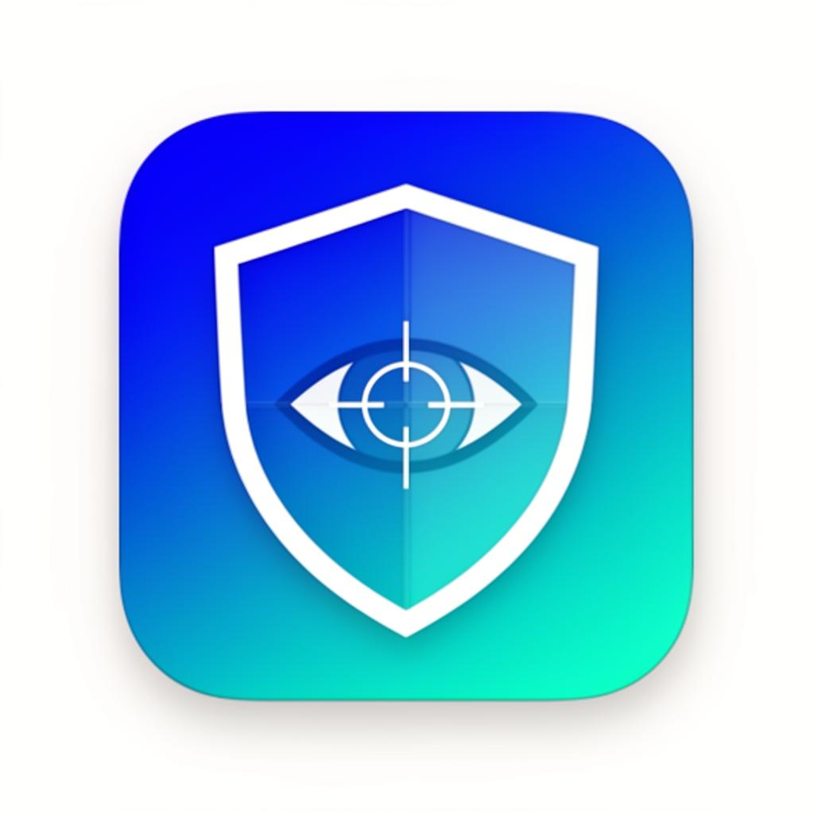

<p align="center">
  
</p>

<h1 align="center">FocusGuard</h1>
<p align="center"><strong>Your focus, protected.</strong></p>

<p align="center">
  A behavioral productivity system that detects distraction patterns, enforces structured focus sessions, and delivers actionable productivity intelligence — all locally in your browser.
</p>

<p align="center">
  <a href="#-installation"></a>
  <a href="LICENSE"></a>
  
  
  <a href="https://tinyurl.com/focusguardextension"></a>
</p>

<p align="center">
  <a href="#-features">Features</a>
  &nbsp;•&nbsp;
  <a href="#-installation">Install</a>
  &nbsp;•&nbsp;
  <a href="#-tech-stack">Tech Stack</a>
  &nbsp;•&nbsp;
  <a href="#-contributing">Contributing</a>
</p>

---

## 📋 Table of Contents

- [What is FocusGuard?](#-what-is-focusguard)
- [Features](#-features)
- [Installation](#-installation)
- [Usage Guide](#-usage-guide)
- [Tech Stack](#-tech-stack)
- [Project Structure](#-project-structure)
- [Architecture](#-architecture)
- [Contributing](#-contributing)
- [Roadmap](#-roadmap)
- [License](#-license)
- [Author](#-author)

---

## 🧠 What is FocusGuard?

FocusGuard is an open-source Chrome extension that acts as your **behavioral productivity system**. It goes far beyond simple site blocking — FocusGuard understands *why* you get distracted, *when* it happens, and *how* to intervene without breaking your flow.

Unlike cloud-based productivity apps, FocusGuard works **entirely locally** — no accounts, no servers, no data collection. Your browsing data never leaves your device.

**Who is it for?**
- 🎓 **Students** — Stay focused during study sessions with intelligent distraction blocking
- 💻 **Developers** — Protect deep work sessions from tab-hopping habits
- 🔬 **Researchers** — Track productive vs. distracted time with behavioral analytics
- 📊 **Professionals** — Understand and optimize your digital work patterns

---

## ✨ Features

### Core Capabilities

| Feature | Description |
|---------|-------------|
| 🧠 **Smart Activity Tracking** | Event-driven monitoring with idle detection. Only meaningful activity counts toward your metrics |
| 🔒 **Focus Mode** | Strict site blocking with task-based unlock. Behavioral intervention, not just a countdown timer |
| 🌐 **Domain Control** | Temporary blocks, daily limits, or scheduled restrictions with cognitive override protection |
| 🧩 **Behavioral Insights** | Detects distraction loops, identifies peak productivity windows, and adapts recommendations |
| 📊 **Analytics Engine** | Weekly trends, category breakdowns, and hourly activity patterns — all beautifully visualized |
| ⚡ **Productivity Score** | Composite score from focus time, session consistency, and behavioral pattern analysis |

### How It Works

| Stage | Description |
|-------|-------------|
| 1️⃣ **Install & Track** | Event-driven monitoring detects active tab usage with intelligent idle detection |
| 2️⃣ **Analyze Patterns** | Categorize domains, detect distraction loops, identify peak productivity windows |
| 3️⃣ **Intervene** | Focus mode enforcement, task-based unlocking, and cognitive friction barriers |
| 4️⃣ **Improve** | Productivity scores, trend analysis, and personalized behavioral recommendations |

### Privacy & Architecture

| Feature | Description |
|---------|-------------|
| 🔐 **Zero Data Collection** | No keystroke logging, no screenshots. Only domain-level time data, stored locally |
| ⚡ **Event-Driven** | No constant polling. Lightweight Manifest V3 service worker that sleeps when inactive |
| 💾 **Local-First Architecture** | All data processed and stored in your browser using Chrome's storage API |

---

## 🚀 Installation

### Load as Unpacked Extension

```bash
# 1. Clone the repository
git clone https://github.com/20-Husna/FocusGuard-Extension.git
cd FocusGuard-Extension

# 2. No build step needed for the extension — it's vanilla JS
#    The extension/ folder is ready to load directly
```

3. Open Chrome and go to `chrome://extensions/`
4. Enable **"Developer mode"** (toggle in the top-right)
5. Click **"Load unpacked"**
6. Select the `extension/` folder from the cloned repo
7. Pin FocusGuard to your toolbar — you're ready!

### Build the Landing Page (Optional)

```bash
npm install
npm run dev
npm run build
```

---

## 📖 Usage Guide

### Quick Start
1. **Install** the extension and pin it to your toolbar
2. **Browse normally** — FocusGuard automatically tracks active tab time
3. **Check your dashboard** — See your productivity score, time breakdown, and trends
4. **Start a focus session** — Block distracting sites and add tasks to accomplish
5. **Review insights** — Learn from your behavioral patterns over time

### Focus Mode
- Add sites to block during focus sessions
- Set task goals that must be completed before unlocking
- Cognitive friction barriers prevent impulsive override
- Pause or end sessions from the popup

### Dashboard
- **Productivity Score** — Composite metric updated in real-time
- **Weekly Trends** — Bar charts comparing productive vs. distracted time
- **Category Breakdown** — Pie chart of time by domain category (Work, Education, Social, etc.)
- **Hourly Heatmap** — See your peak productivity hours

---

## 🏗️ Tech Stack

| Layer | Technology |
|-------|-----------|
| **Extension Runtime** | Chrome Manifest V3, Vanilla JavaScript (ES Modules) |
| **Background Worker** | Service worker with event-driven architecture |
| **Popup & Dashboard** | HTML, CSS, JavaScript (no framework dependency) |
| **Landing Page** | React 18, TypeScript, Vite, Tailwind CSS, Framer Motion |
| **UI Components** | shadcn/ui, Radix UI primitives, Recharts |
| **State Management** | Chrome Storage API (local + sync) |

---

## 📂 Project Structure

```
focusguard/
├── extension/                    # Chrome Extension (standalone)
│   ├── background.js             # Service worker — event-driven monitoring
│   ├── content.js                # Content script — page interaction
│   ├── popup/                    # Popup UI
│   │   ├── popup.html
│   │   ├── popup.css
│   │   └── popup.js
│   ├── dashboard/                # Dashboard UI
│   │   ├── dashboard.html
│   │   ├── dashboard.css
│   │   └── dashboard.js
│   ├── blocked/                  # Blocked page UI
│   │   ├── blocked.html
│   │   ├── blocked.css
│   │   └── blocked.js
│   ├── onboarding/               # Onboarding flow
│   │   ├── onboarding.html
│   │   ├── onboarding.css
│   │   └── onboarding.js
│   ├── utils/                    # Shared utilities
│   │   ├── storage.js            # Chrome storage abstraction
│   │   ├── categories.js         # Domain categorization engine
│   │   ├── scoring.js            # Productivity score calculator
│   │   ├── insights.js           # Behavioral insight generator
│   │   ├── achievements.js       # Achievement system
│   │   └── popular-sites.js      # Popular site database
│   ├── assets/                   # Shared styles & theme
│   ├── icons/                    # Extension icons (16, 48, 128px)
│   ├── manifest.json             # Chrome extension manifest
│   └── rules.json                # Declarative net request rules
│
├── src/                          # Landing Page (React + Vite)
│   ├── components/
│   │   ├── Navbar.tsx
│   │   ├── PageTransition.tsx
│   │   ├── AnimatedRoutes.tsx
│   │   └── ui/                   # shadcn/ui components
│   ├── pages/
│   │   ├── Landing.tsx           # Main landing page
│   │   ├── Dashboard.tsx         # Web dashboard preview
│   │   └── FocusMode.tsx         # Focus mode preview
│   ├── data/
│   │   └── mockData.ts           # Dashboard mock data
│   ├── assets/                   # Images & icons
│   └── index.css                 # Design tokens & global styles
│
├── CHANGELOG.md                  # Version history
├── CONTRIBUTING.md               # Contribution guidelines
├── LICENSE                       # MIT License
└── README.md                     # You are here
```

---

## 🏛️ Architecture

```
┌─────────────────────────────────────────────────────────────┐
│                     CHROME BROWSER                          │
│                                                             │
│  ┌──────────────┐    ┌──────────────┐    ┌──────────────┐  │
│  │  Popup UI    │    │Content Script │    │  Background   │  │
│  │              │    │              │    │  Worker       │  │
│  │ • Quick View │◄──►│ • Page       │◄──►│ • Tracking   │  │
│  │ • Focus Mode │    │   Detection  │    │ • Scoring    │  │
│  │ • Controls   │    │ • Blocked    │    │ • Categories │  │
│  │              │    │   Page       │    │ • Insights   │  │
│  └──────────────┘    └──────────────┘    └──────┬───────┘  │
│                                                  │          │
│  ┌──────────────┐                               │          │
│  │  Dashboard   │◄──────────────────────────────┘          │
│  │ • Analytics  │                                          │
│  │ • Trends     │    All data stored locally via           │
│  │ • Settings   │    chrome.storage API                    │
│  └──────────────┘                                          │
└─────────────────────────────────────────────────────────────┘
```

**Key Design Decisions:**
- **Event-Driven Architecture** — No constant polling. Service worker activates only on tab changes
- **Local-First Data** — All data stored via `chrome.storage.local`. Nothing leaves the browser
- **Manifest V3** — Modern extension architecture with minimal resource usage
- **Behavioral Intelligence** — Pattern detection and distraction loop identification, not just time tracking
- **Cognitive Friction** — Task-based unlocking prevents impulsive site access during focus sessions

---

## 🤝 Contributing

Contributions are welcome! See [CONTRIBUTING.md](CONTRIBUTING.md) for detailed guidelines.

### Quick Start

```bash
git clone https://github.com/20-Husna/FocusGuard-Extension.git
cd FocusGuard-Extension
npm install
npm run dev
```

For extension development, load the `extension/` folder as an unpacked extension — no build step required.

---

## 🗺️ Roadmap

- [ ] Chrome Web Store publication
- [ ] Firefox & Edge extension ports
- [ ] Advanced distraction pattern ML models
- [ ] Team productivity dashboards
- [ ] Cross-device sync (optional, encrypted)
- [ ] Pomodoro technique integration
- [ ] Calendar integration for scheduled focus blocks
- [ ] API for third-party integrations

---

## 📄 License

This project is licensed under the **MIT License** — see the [LICENSE](LICENSE) file for details.

You are free to use, modify, and distribute this software for any purpose.

---

## 👤 Author

<table>
  <tr>
    <td align="center">
      <strong>Husna Ayoub</strong><br/>
      Co-Founder — HH Nexus<br/>
      Kabul, Afghanistan 🇦🇫<br/><br/>
      <a href="https://github.com/20-Husna/FocusGuard-Extension">GitHub</a> •
      <a href="https://www.linkedin.com/in/husna-a-7971b7272/">LinkedIn</a> •
      <a href="mailto:ayoubhusna9462@gmail.com">Email</a>
    </td>
  </tr>
</table>

---

<p align="center">
  <strong>⭐ If you find FocusGuard useful, please consider giving it a star!</strong>
</p>

<p align="center">
  <em>Built with ❤️ for every curious mind.</em>
</p>
